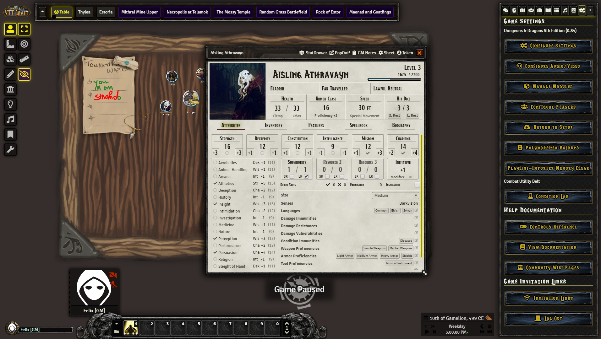
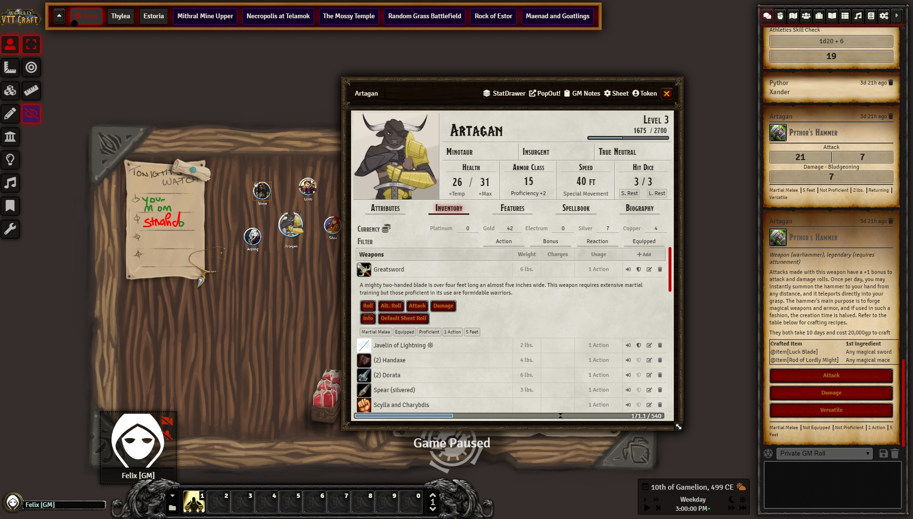
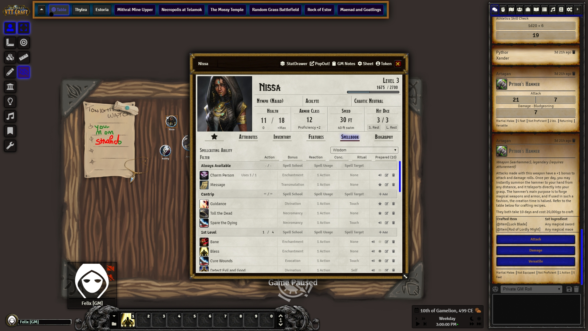

# VTT Craft

A World of Warcraft themed reskin for Foundry VTT

## Installation
1. Copy this link and use it in Foundrys Module Manager to install the Module

    > https://raw.githubusercontent.com/syl3r86/vtt-craft/master/module.json
    
2. Enable the Module in your Worlds Module Manager

3. Choose one of the 3 skins on offer in the Module Settings

## Details
This module contains 3 different styles to choose from. There is a generic style called Neutral and one for the Horde (yay) and Alliance (booooo). And even though I have a clear preference in terms of factions, both skins are as good as I'm able to make them (at the moment).

## Previews

### Neutral

### Horde

### Alliance

## Contribution
If you feel like supporting my work, feel free to leave a tip at my paypal felix.mueller.86@web.de or click the sponsor button in the top.

## License
Most images are property of or based upon images by Blizzard Entertainment.

All coding (css and javascript) falls under the following license:
 VTT Craft - a module for Foundry VTT - by <a xmlns:cc="http://creativecommons.org/ns#" href="https://github.com/syl3r86?tab=repositories" property="cc:attributionName" rel="cc:attributionURL">Felix Müller</a> is licensed under a <a rel="license" href="http://creativecommons.org/licenses/by/4.0/">Creative Commons Attribution 4.0 International License</a>.

This work is licensed under Foundry Virtual Tabletop [EULA - Limited License Agreement for module development v 0.3.8](http://foundryvtt.com/pages/license.html).
